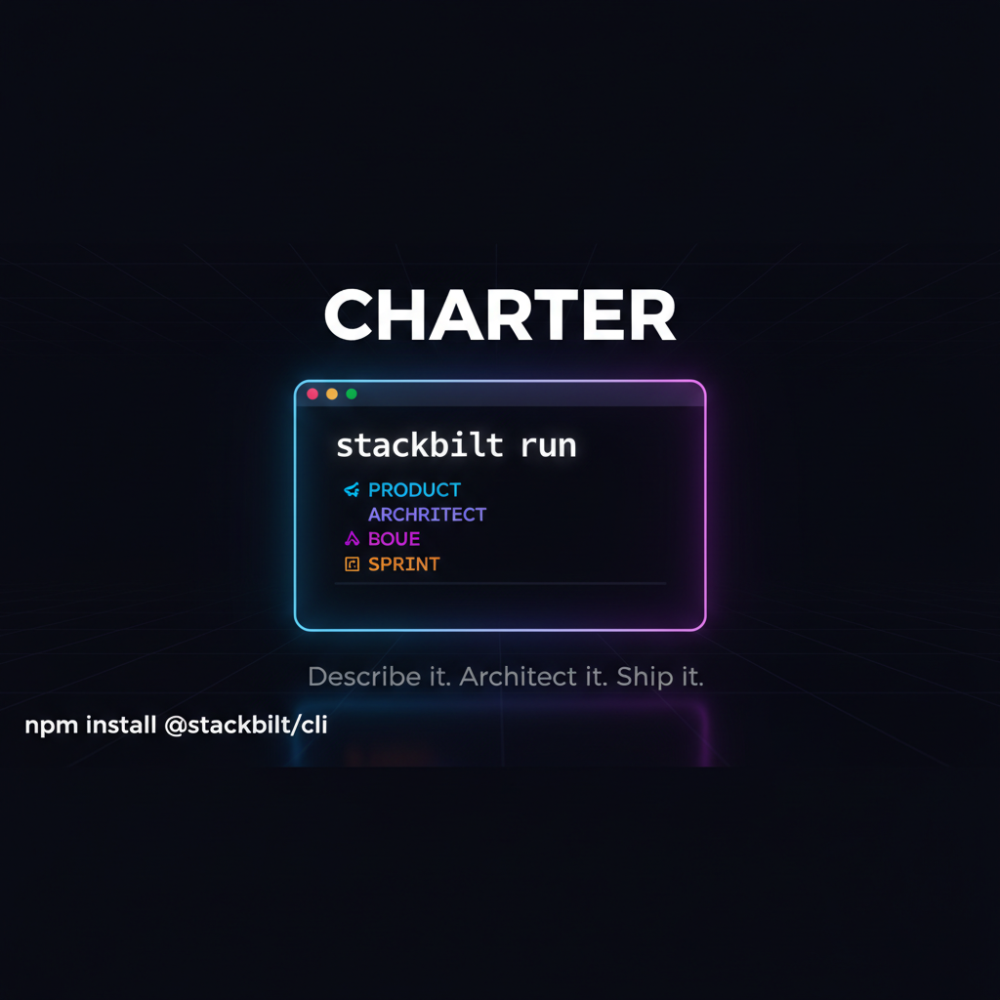
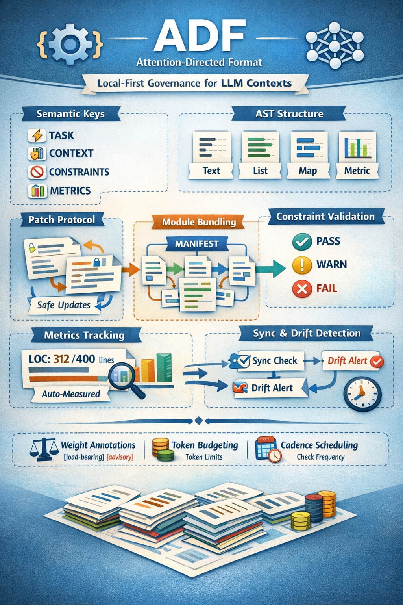

# Charter Kit



> **ADF is currently running its inaugural full-SDLC cycle to gather real-world data for iterative improvement. Updates coming soon and regularly.**

Charter is a local-first governance toolkit with a built-in AI context compiler. It ships **ADF (Attention-Directed Format)** -- a modular, AST-backed context system that replaces monolithic `.cursorrules` and `claude.md` files -- alongside offline governance checks for commit trailers, risk scoring, drift detection, and change classification.



## ADF: Attention-Directed Format

ADF treats LLM context as a compiled language. Instead of dumping flat markdown into a context window, ADF uses emoji-decorated semantic keys, a strict AST, and a module system with progressive disclosure -- so agents load only the context they need for the current task.

Charter manages ADF through the `.ai/` directory:

```text
.ai/
  manifest.adf    # Module registry: default-load vs on-demand with trigger keywords
  core.adf        # Always-loaded context (role, constraints, output format)
  state.adf       # Session state (current task, decisions, blockers)
  frontend.adf    # On-demand: loaded when task mentions "react", "css", etc.
  api.adf         # On-demand: loaded when task mentions "endpoint", "REST", etc.
```

### Quick Start

```bash
# Scaffold the .ai/ directory with starter modules
charter adf init

# Reformat an ADF file to canonical form
charter adf fmt .ai/core.adf --write

# Apply a typed patch (add a bullet to a list section)
charter adf patch .ai/state.adf --ops '[{"op":"ADD_BULLET","section":"STATE","value":"Reviewing PR #42"}]'

# Bundle context for a specific task -- resolves manifest triggers automatically
charter adf bundle --task "Fix the React login component"

# Migrate existing agent configs (CLAUDE.md, .cursorrules, etc.) into ADF modules
charter adf migrate --dry-run

# Verify source .adf files haven't drifted from locked hashes
charter adf sync --check

# Validate metric constraints and produce a structured evidence report
charter adf evidence --auto-measure --format json
charter telemetry report --period 24h --format json
```

### Format Example

```text
ADF: 0.1

🎯 TASK:
  Build the user dashboard

📋 CONTEXT:
  - React 18 with TypeScript
  - TailwindCSS for styling
  - REST API at /api/v2

⚠️ CONSTRAINTS [load-bearing]:
  - No external state libraries
  - Must support SSR

📊 METRICS [load-bearing]:
  entry_loc: 142 / 500 [lines]
  handler_loc: 88 / 300 [lines]

🧠 STATE:
  CURRENT: Implementing layout grid
  NEXT: Add data fetching
  BLOCKED: Waiting on API schema
```

Sections use emoji decorations for attention signaling, support four content types (text, list, key-value map, and metric with value/ceiling/unit), and follow a canonical ordering that the formatter enforces. Sections can carry a `[load-bearing]` or `[advisory]` weight annotation to distinguish measurable constraints from preferences. Metric entries (`key: value / ceiling [unit]`) define hard ceilings that the `evidence` command validates automatically.

See the [`@stackbilt/adf` package README](./packages/adf/README.md) for full API documentation.

## Self-Governance

Charter uses its own ADF system to govern its own codebase. The `.ai/` directory in this repository contains the same modules and metric ceilings that any adopting repo would use -- meaning every Charter commit is subject to the same constraint checks the tool enforces on others.

To reproduce this, run the evidence command against Charter's own context directory:

```bash
charter adf evidence --auto-measure
```

Here is the actual output from Charter's dogfood run:

```text
  ADF Evidence Report
  ===================
  Modules loaded: core.adf, state.adf
  Token estimate: ~371
  Token budget: 4000 (9%)

  Auto-measured:
    adf_commands_loc: 413 lines (packages/cli/src/commands/adf.ts)
    adf_bundle_loc: 154 lines (packages/cli/src/commands/adf-bundle.ts)
    adf_sync_loc: 204 lines (packages/cli/src/commands/adf-sync.ts)
    adf_evidence_loc: 263 lines (packages/cli/src/commands/adf-evidence.ts)
    adf_migrate_loc: 453 lines (packages/cli/src/commands/adf-migrate.ts)
    bundler_loc: 415 lines (packages/adf/src/bundler.ts)
    parser_loc: 214 lines (packages/adf/src/parser.ts)
    cli_entry_loc: 149 lines (packages/cli/src/index.ts)

  Section weights:
    Load-bearing: 2
    Advisory: 0
    Unweighted: 3

  Constraints:
    [ok] adf_commands_loc: 413 / 500 [lines] -- PASS
    [ok] adf_bundle_loc: 154 / 200 [lines] -- PASS
    [ok] adf_sync_loc: 204 / 250 [lines] -- PASS
    [ok] adf_evidence_loc: 263 / 300 [lines] -- PASS
    [ok] adf_migrate_loc: 453 / 500 [lines] -- PASS
    [ok] bundler_loc: 415 / 500 [lines] -- PASS
    [ok] parser_loc: 214 / 300 [lines] -- PASS
    [ok] cli_entry_loc: 149 / 200 [lines] -- PASS

  Sync: all sources in sync

  Verdict: PASS
```

What this shows:

- **Metric ceilings enforce LOC limits on source files.** Each key in the `METRICS` section of an `.adf` module declares a ceiling. The `--auto-measure` flag counts lines live from the source files referenced in the manifest.
- **Self-correcting architecture.** When `adf_commands_loc` hit 93% of its 900-line ceiling in v0.3.4, Charter's own evidence gate caught it. The file was split into four focused modules (`adf.ts`, `adf-bundle.ts`, `adf-sync.ts`, `adf-evidence.ts`), each with its own ceiling. The pre-commit hook now prevents this from happening silently again.
- **CI gating.** Generated governance workflows run `charter doctor --adf-only --ci` and `charter adf evidence --auto-measure --ci` when `.ai/manifest.adf` is present, blocking merges on ADF wiring violations or ceiling breaches.
- **Pre-commit enforcement.** `charter hook install --pre-commit` installs a git hook that enforces `doctor --adf-only` + ADF evidence checks (or `pnpm run verify:adf` when present). When an agent runs unattended, wiring/ceiling violations block the commit.
- **Available to any repo.** This is the same system you get by running `charter adf init` in your own project.

## Why Charter

- **ADF context compiler** -- modular `.ai/` context files with AST-backed parsing, formatting, patching, bundling, sync, and constraint validation
- **Evidence-based governance** -- metric ceilings with auto-measurement, structured pass/fail evidence reports, and CI gating
- **Commit governance** -- validate `Governed-By` and `Resolves-Request` trailers, score commit risk
- **Drift detection** -- scan for stack drift against blessed patterns
- **Change classification** -- heuristic `SURFACE`, `LOCAL`, or `CROSS_CUTTING` scope labeling
- **Stable JSON output** -- every command supports `--format json` with `nextActions` hints for agent workflows

## Install

```bash
npm install --save-dev @stackbilt/cli
npx charter setup --detect-only --format json
npx charter setup --ci github --yes
```

For pnpm workspaces use `pnpm add -Dw @stackbilt/cli`. For a global install use `npm install -g @stackbilt/cli`.

## Getting Started

### Human Workflow

```bash
charter                              # Repo risk/value snapshot
charter setup --ci github            # Apply governance baseline
charter doctor                       # Validate environment/config
charter validate                     # Check commit governance
charter drift                        # Scan for stack drift
charter audit                        # Governance summary
charter adf init                     # Scaffold .ai/ context directory
```

### Agent Workflow

Prefer JSON mode and exit-code handling:

```bash
charter --format json
charter setup --ci github --yes --format json
charter doctor --format json
charter validate --format json --ci
charter drift --format json --ci
charter audit --format json
charter adf bundle --task "describe the task" --format json
charter adf evidence --auto-measure --format json --ci
charter adf sync --check --format json
charter telemetry report --period 24h --format json
```

Agent contract:
- Inputs: git repo + optional existing `.charter/`
- Stable machine output: `--format json` with `nextActions` hints where applicable
- Exit codes: `0` success, `1` policy violation, `2` runtime/usage error
- CI behavior: with `--ci`, treat `1` as gating failure and surface actionable remediation
- Evidence: `adf evidence --ci` exits 1 on metric ceiling breaches; warnings (at boundary) don't fail

<details>
<summary>Trailer Adoption Ramp</summary>

Teams often score lower early due to missing governance trailers. Use this ramp:
- Stage 1: run `charter validate --ci --format json` in PR CI and fail on policy violations.
- Stage 2: add a commit template in the repo that includes `Governed-By` and `Resolves-Request`.
- Stage 3: track audit trend; trailer coverage should rise naturally as PR gating normalizes behavior.

</details>

## Command Reference

- `charter`: show repo risk/value snapshot and recommended next action
- `charter setup [--ci github] [--preset <worker|frontend|backend|fullstack>] [--detect-only] [--no-dependency-sync]`: detect stack and scaffold `.charter/` baseline
- `charter init [--preset <worker|frontend|backend|fullstack>]`: scaffold `.charter/` templates only
- `charter doctor [--adf-only]`: validate environment/config state (`--adf-only` runs strict ADF wiring checks)
- `charter validate [--ci] [--range <revset>]`: validate commit governance and citations
- `charter drift [--path <dir>] [--ci]`: run drift scan
- `charter audit [--ci] [--range <revset>]`: produce governance audit summary
- `charter classify <subject>`: classify change scope heuristically
- `charter hook install --commit-msg [--force]`: install commit-msg trailer normalization hook
- `charter hook install --pre-commit [--force]`: install pre-commit ADF routing + evidence gate (`doctor --adf-only` + `adf evidence`)
- `charter adf init [--ai-dir <dir>] [--force]`: scaffold `.ai/` context directory with manifest, core, state, and starter on-demand modules
- `charter adf fmt <file> [--check] [--write]`: parse and reformat ADF files to canonical form
- `charter adf fmt --explain`: show canonical formatter section ordering
- `charter adf patch <file> --ops <json> | --ops-file <path>`: apply typed delta operations to ADF files
- `charter adf create <module> [--triggers "a,b,c"] [--load default|on-demand]`: create/register a module in one step
- `charter adf bundle --task "<prompt>" [--ai-dir <dir>]`: resolve manifest modules and output merged context with trigger observability
- `charter adf sync --check [--ai-dir <dir>]`: verify source .adf files match locked hashes (exit 1 on drift)
- `charter adf sync --write [--ai-dir <dir>]`: update `.adf.lock` with current source hashes
- `charter adf evidence [--task "<prompt>"] [--ai-dir <dir>] [--auto-measure] [--context '{"k":v}'] [--context-file <path>]`: validate metric constraints and produce structured evidence report
- `charter adf migrate [--dry-run] [--source <file>] [--no-backup] [--merge-strategy append|dedupe|replace]`: ingest existing agent config files and migrate content into ADF modules
- `charter telemetry report [--period <30m|24h|7d>]`: summarize passive local CLI telemetry from `.charter/telemetry/events.ndjson`
- `charter why`: explain adoption rationale and expected payoff

Global options: `--config <path>`, `--format text|json`, `--ci`, `--yes`.

Audit policy scoring note:
- Policy score now uses configurable section coverage (`config.audit.policyCoverage.requiredSections`) instead of raw markdown file count.

## Exit Code Contract

- `0`: success/pass
- `1`: policy violation in CI mode
- `2`: runtime/config/usage error

## CI Integration

- Reusable template in this repo: `.github/workflows/governance.yml`
- Generated in target repos by `charter setup --ci github`: `.github/workflows/charter-governance.yml`
- The governance workflow runs `validate`, `drift`, ADF wiring integrity (`doctor --adf-only --ci`), ADF ceiling evidence (`adf evidence --auto-measure --ci`), and `audit` on every PR.

## Workspace Layout

```text
packages/
  types/      Shared contracts
  core/       Schemas, sanitization, errors
  adf/        ADF parser, formatter, patcher, bundler (AI context format)
  git/        Trailer parsing and risk scoring
  classify/   Heuristic classification
  validate/   Governance validation
  drift/      Pattern drift scanning
  cli/        `charter` command
  ci/         GitHub Actions integration helpers
```

## Development

- `pnpm run clean`
- `pnpm run typecheck`
- `pnpm run build`
- `pnpm run test`

## Research & White Papers

The [`papers/`](./papers/) directory contains versioned white papers documenting
ADF design rationale and quantitative analysis.

| Paper | Description |
|---|---|
| [Context-as-Code v1.1](./papers/context-as-code-v1.1.md) | Quantifies ADF impact on a PRD-driven AI Orchestration Engine v2 SDLC: 80% token reduction, 0% LOC-limit violations across 33 modules. |

## Release Docs

- `PUBLISHING.md`: first release/publish workflow
- `CHANGELOG.md`: user-visible change history
- `CONTRIBUTING.md`: contribution conventions
- `SECURITY.md`: vulnerability reporting

## License

Apache-2.0. See [LICENSE](./LICENSE).

<p>
  <a href="https://www.buymeacoffee.com/kurto" target="_blank" rel="noopener noreferrer">
    
  </a>
</p>
