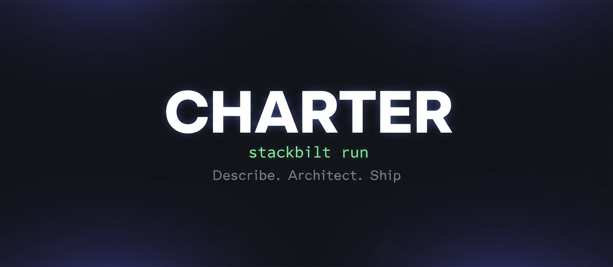

# Charter

[](https://www.npmjs.com/package/@stackbilt/cli)
[](./LICENSE)
[](https://discord.gg/aJmE8wmQDS)



## Your first Cloudflare Workers project shouldn't take a week.

```bash
npx @stackbilt/cli run "A real-time chat app on Cloudflare Workers with D1, auth, and rate limiting"
```

One command. Architecture designed, stack selected, files scaffolded. No boilerplate, no templates, no inference cost -- the engine is deterministic.

```
  ✓ Analyzing requirements...
  ✓ Selecting stack (7 components, compatibility: 94/100)
  ✓ Scaffolding project...

  Created 12 files in ./realtime-chat/
    src/index.ts        — Hono API with WebSocket upgrade
    src/auth.ts         — JWT middleware + session management
    src/chat-room.ts    — Durable Object for room state
    wrangler.toml       — D1 binding, DO namespace, rate limiting
    schema.sql          — Users, rooms, messages tables
    ...

  Run: cd realtime-chat && npm install && npx wrangler dev
```

Add constraints to narrow the output:

```bash
stackbilt run "Invoice processing API" --cloudflare-only --framework Hono --database D1
stackbilt run --file spec.md   # Or feed a full spec
```

## What you get

Charter scaffolds production-ready projects, not starter templates. Scaffolded projects can include patterns from the [Stackbilt ecosystem](https://github.com/Stackbilt-dev) -- battle-tested packages extracted from 70+ real-world projects:

| Package | What it does |
|---------|-------------|
| [@stackbilt/llm-providers](https://github.com/Stackbilt-dev/llm-providers) | Multi-LLM failover with circuit breakers and cost tracking |
| [@stackbilt/worker-observability](https://github.com/Stackbilt-dev/worker-observability) | Health checks, structured logging, metrics, tracing, SLI/SLO |
| [@stackbilt/audit-chain](https://github.com/Stackbilt-dev/audit-chain) | Tamper-evident SHA-256 hash-chained audit trails |
| [@stackbilt/adf](https://www.npmjs.com/package/@stackbilt/adf) | Modular AI agent context system (see below) |

Plus governance out of the box: `.ai/` directory with ADF modules, metric ceilings, and optional CI gating.

## Install

```bash
npm install --save-dev @stackbilt/cli
```

For pnpm workspaces: `pnpm add -Dw @stackbilt/cli`. For global install: `npm install -g @stackbilt/cli`.

**Free to try.** `charter login --key sb_live_xxx` to connect your [Stackbilt](https://stackbilt.dev) API key for full scaffold output.

## AI agent governance with ADF

Charter replaces monolithic agent config files (CLAUDE.md, .cursorrules, GEMINI.md) with **ADF (Attention-Directed Format)** -- a modular context system where agents load only the rules they need.

**The problem:** You write 10,000 tokens of flat rules. Your agent loads all of it. Half gets ignored. You don't know which half.

**The fix:** A manifest that declares modules, trigger keywords that load them on demand, token budgets, and weighted sections that tell the agent what matters.

```bash
charter bootstrap --yes   # detect stack, scaffold .ai/, migrate existing rules
```

### How it works

```text
.ai/
  manifest.adf    # Module registry: default vs on-demand with trigger keywords
  core.adf        # Always loaded: role, constraints, metric ceilings
  state.adf       # Session state: current task, decisions, blockers
  frontend.adf    # On-demand: loaded when task mentions "react", "css", etc.
  backend.adf     # On-demand: loaded when task mentions "endpoint", "REST", etc.
```

When you run `charter adf bundle --task "Fix the React login component"`, Charter loads `core.adf` + `state.adf` (always), adds `frontend.adf` (trigger match on "React"), skips `backend.adf`. The agent gets exactly the rules it needs.

### Five-minute migration

Already have agent config files? Charter migrates them:

```bash
charter adf migrate --dry-run   # Preview what would happen
charter adf migrate             # Classify rules, route to ADF modules, replace originals
```

Your existing content gets classified by strength (imperative vs. advisory), routed to the right module, and originals become one-line pointers to `.ai/`. No content lost.

### Metric ceilings

ADF modules can declare measurable constraints:

```text
METRICS [load-bearing]:
  entry_loc: 142 / 500 [lines]
  handler_loc: 88 / 300 [lines]
```

`charter adf evidence --auto-measure` validates these live. Pre-commit hooks reject code that exceeds ceilings. CI workflows gate merges. Charter enforces its own rules on its own codebase -- every commit.

### MCP server for Claude Code

```json
{
  "mcpServers": {
    "charter": {
      "command": "charter",
      "args": ["serve"]
    }
  }
}
```

Claude Code can query `getProjectContext`, `getArchitecturalDecisions`, `getProjectState`, and `getRecentChanges` directly.

## Commands

### Build

```bash
stackbilt run "description"              # Architect + scaffold in one step
charter architect "description"          # Generate stack selection
charter scaffold --output ./my-project   # Write files from last build
charter login --key sb_live_xxx          # Store API key (one-time)
```

### Govern

```bash
charter                                  # Repo risk/value snapshot
charter bootstrap --ci github            # One-command onboarding
charter doctor                           # Environment/config health check
charter validate                         # Commit governance (trailers)
charter drift                            # Pattern drift scanning
charter audit                            # Governance summary
```

### ADF

```bash
charter adf init                         # Scaffold .ai/ directory
charter adf bundle --task "..."          # Merge context for a task
charter adf evidence --auto-measure      # Validate metric constraints
charter adf migrate                      # Migrate existing configs
charter adf sync --check                 # Verify files match lock
charter adf fmt .ai/core.adf --write     # Reformat to canonical form
charter adf metrics recalibrate          # Adjust ceilings to current state
charter serve                            # MCP server for Claude Code
```

All commands support `--format json` with `nextActions` hints for agent workflows.

### Exit codes

- `0`: success
- `1`: policy violation (CI mode)
- `2`: runtime/usage error

## Modular packages

Charter is built as a monorepo. Individual packages are published to npm and usable independently:

| Package | Purpose |
|---------|---------|
| `@stackbilt/adf` | ADF parser, formatter, patcher, bundler, evidence pipeline |
| `@stackbilt/git` | Trailer parsing, commit risk scoring |
| `@stackbilt/classify` | Heuristic change classification |
| `@stackbilt/validate` | Governance validation |
| `@stackbilt/drift` | Anti-pattern scanning |
| `@stackbilt/core` | Schemas, sanitization, error contracts |
| `@stackbilt/types` | Shared TypeScript contracts |
| `@stackbilt/ci` | GitHub Actions integration helpers |

## Development

```bash
pnpm install && pnpm run build && pnpm run test
```

Full publish workflow: see [PUBLISHING.md](./PUBLISHING.md).

## License

Apache-2.0. See [LICENSE](./LICENSE).

---

Built by [Kurt Overmier](https://github.com/kurtovermier) / [Stackbilt](https://stackbilt.dev)

<p>
  <a href="https://www.buymeacoffee.com/kurto" target="_blank" rel="noopener noreferrer">
    
  </a>
</p>
