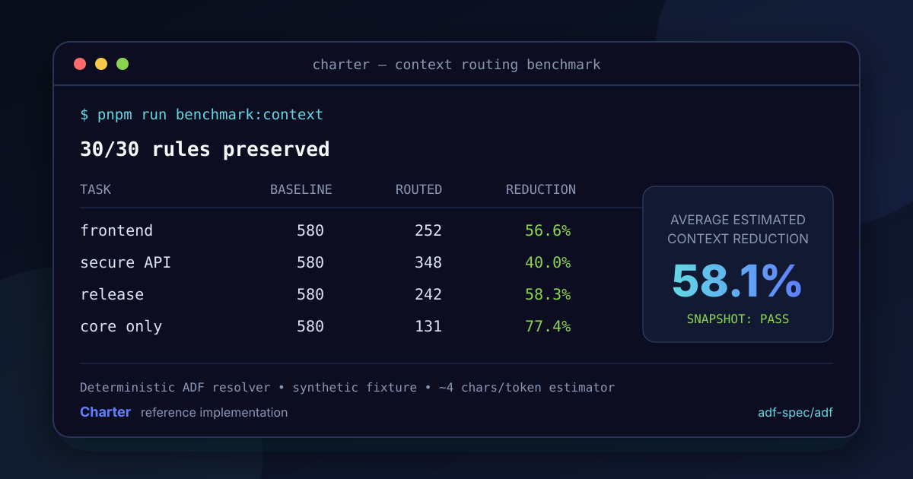

# Charter

[](#measured-on-a-real-build)
[](https://www.npmjs.com/package/@stackbilt/cli)
[](./LICENSE)
[](https://discord.gg/aJmE8wmQDS)

## The context compiler for AI coding agents

**Write your project rules once. Give every coding agent only the context it needs.**

Charter turns sprawling `CLAUDE.md`, `AGENTS.md`, `.cursorrules`, and `GEMINI.md` files into one modular source of truth. It routes task-specific instructions on demand, enforces context budgets, and compiles the result back to every supported agent format.

Start with a read-only audit. It changes no project files and needs no account; after `npx` obtains the package, the audit runs locally without product network calls:

```bash
npx @stackbilt/cli score
```

`charter score` grades your repository's agent configuration, grounding, architecture, testing, governance, and freshness—then gives you the five highest-impact fixes.

| Before Charter | With Charter |
|---|---|
| Every task loads one giant instruction file | Each task can load only matching context modules |
| Claude, Codex, Cursor, and Gemini configs drift apart | `.ai/` is the source; vendor files are compiled artifacts |
| Important constraints compete with preferences | Load-bearing rules and measurable ceilings are explicit |
| Context quality is subjective | `charter score`, evidence checks, and CI produce repeatable results |

### From audit to compiled context

```bash
# 1. Inspect the repo without changing it
npx @stackbilt/cli score

# 2. Detect the stack, create .ai/, and migrate existing agent rules
npx @stackbilt/cli bootstrap --yes

# 3. Generate every vendor file from the same modular source
npx charter adf compile --target all --write
```

```text
.ai/                         generated agent files
├── manifest.adf             ├── CLAUDE.md
├── core.adf        ──────►  ├── AGENTS.md
├── frontend.adf             ├── .cursorrules
└── backend.adf              └── GEMINI.md
```

The manifest keeps universal rules loaded, activates specialist modules using task triggers, and caps the resulting context. `charter adf compile --target all --check` turns vendor-file drift into a CI failure.

### Measured and reproducible



The [context-routing benchmark](./examples/context-routing-benchmark/) preserves 30/30 synthetic rules and measures **40.0–77.4% less estimated task context** across four pinned tasks:

```bash
pnpm run build
pnpm run benchmark:context
```

The exact-scoring migration harness extracts 178/178 expected items and restores 38/38 vendor pointers; 29/38 sessions currently match every reviewed module count. Its nine mismatches remain committed as known failures:

```bash
pnpm run benchmark:routing
```

The [Charter Evidence Register](./papers/charter-evidence-2026-08.md) distinguishes reproducible results from historical observations, publishes unfavorable findings, and lists claims these measurements do not support. The older [greenfield case study](./papers/context-as-code-greenfield-v0.1.md) is retained as an explicitly limited retrospective.

Charter also governs itself. The score badge at the top of this README is generated from [`.charter/badge.json`](./.charter/badge.json), and its metric ceilings run in pre-commit and CI.

### Open, local, and vendor-neutral

- **Local-first:** the CLI makes no product network calls and stores no credentials.
- **Cross-agent:** compile for Claude Code, Codex, Cursor, and Gemini.
- **Open specification:** [ADF lives in the vendor-neutral `adf-spec` organization](https://github.com/adf-spec/adf); Charter is the reference implementation.
- **Useful beyond context:** inspect blast radius, extract API surfaces, detect drift, and expose bounded project context through MCP.

## What you get

- **Context compilation** — one modular `.ai/` source compiled into every supported agent format.
- **Task-aware loading** — trigger-routed modules and token budgets keep irrelevant rules out of the prompt.
- **Measurable constraints** — LOC and bloat ceilings validated at commit time and in CI.
- **AI-readiness scoring** — a deterministic grade, prioritized fixes, and a shareable README badge.
- **Codebase analysis** — reverse-dependency graphs and route/schema fingerprints without LLM calls.
- **MCP context** — a bounded project brief for Claude Code, Codex, and Cursor.

## Install

```bash
npm install --save-dev @stackbilt/cli
```

For pnpm workspaces: `pnpm add -Dw @stackbilt/cli`. For global install: `npm install -g @stackbilt/cli`.

### Non-Node repos (C++, Go, Rust, etc.)

Charter works as a local governance tool in any repo — Node is not required as your primary build system. Add it as a dev dependency and invoke it without a global install:

```bash
# Install (WSL-safe mode if you hit symlink errors — see below)
npm install --save-dev @stackbilt/cli --no-bin-links

# Run via npx (resolves from local node_modules, no global install needed)
npx --no-install charter bootstrap --yes
npx --no-install charter doctor --adf-only

# Or invoke directly
./node_modules/.bin/charter doctor --adf-only
```

Add to your `package.json` scripts for convenience:

```json
"scripts": {
  "governance:check": "charter audit --ci",
  "governance:doctor": "charter doctor --adf-only"
}
```

### Rust/WASM projects

Charter has first-class support for Rust/WASM libraries built with `wasm-pack`. Running `charter bootstrap` in a repo with `Cargo.toml` and `wasm-bindgen` signals detects the project automatically and selects the `rust-wasm` preset — no `--preset` flag needed.

What you get with `--preset rust-wasm`:

- **No Cloudflare Worker artifacts** — `wrangler.toml`, `schema.sql`, and `src/worker.ts` are never generated
- **Correct project skeleton** — `Cargo.toml` (cdylib + rlib), `src/lib.rs`, `tests/integration.rs`
- **Aware CI workflow** — `dtolnay/rust-toolchain@stable` + `wasm32-unknown-unknown` target + `wasm-pack test --node` + `wasm-pack build --target bundler`
- **Publish boundary awareness** — `charter score` looks inside `pkg/package.json` (wasm-pack output) for metadata, not the private root `package.json`
- **`rust-wasm.adf`** — library-specific ADF module covering pure-export constraints, dual crate-type requirement, and the `pkg/` publish boundary

```bash
# In a fresh Rust/WASM crate
charter bootstrap --preset rust-wasm --yes

# Or let auto-detection pick it up (requires Cargo.toml with wasm-bindgen)
charter bootstrap --yes
```

### WSL / DrvFs installs

Two distinct issues can appear when the repo lives on a Windows-mounted filesystem (`/mnt/c/...`, `/mnt/d/...`):

| Symptom | Package manager | Fix |
|---------|----------------|-----|
| `EPERM: operation not permitted, symlink` on `.bin/charter` | npm | `npm install --save-dev @stackbilt/cli --no-bin-links` — skips symlink creation; use `npx --no-install charter` or `./node_modules/.bin/charter` to invoke |
| `EACCES` on atomic rename during install | pnpm | `pnpm add --force` or move the repo to a Linux-native path (`~/projects/`) |

Both flags are safe for CI environments where the filesystem is Linux-native — the workarounds only matter locally on DrvFs mounts.

### npm peer-dependency conflicts on install/upgrade

Installing or upgrading `@stackbilt/cli` can fail under npm's strict peer resolver with an `ERESOLVE` error — for example, a conflict involving `zod` when your app already depends on a package whose peer range differs from Charter's (`zod@^3`):

```text
npm error ERESOLVE could not resolve
npm error While resolving: your-app@x.y.z
npm error Found: zod@3.x  …  peer zod@"^4.0.0" from agents@0.12.3
```

This is a conflict in your existing dependency tree that npm surfaces while re-resolving — Charter's runtime is unaffected once installed. Fix it one of two ways:

| Fix | When |
|-----|------|
| `npm install --save-dev @stackbilt/cli --legacy-peer-deps` | Fastest unblock; tells npm to use the looser legacy resolution it used before v7 |
| Align the conflicting dependency's version in your app (e.g. upgrade/downgrade `zod` so one range satisfies both) | Preferred long-term; removes the conflict at its source |

`pnpm` and `yarn` use a more permissive resolver and generally install without this flag.

## How ADF works

A manifest declares modules, trigger keywords load them on demand, token budgets cap each one, and weighted sections tell the agent what matters.

ADF operationalizes the Context Engineering principles documented in Stackbilt's [ai-playbook](https://github.com/Stackbilt-dev/ai-playbook).

```text
.ai/
  manifest.adf    # Module registry: default vs on-demand with trigger keywords
  core.adf        # Always loaded: role, constraints, metric ceilings
  state.adf       # Session state: current task, decisions, blockers
  frontend.adf    # On-demand: loaded when task mentions "react", "css", etc.
  backend.adf     # On-demand: loaded when task mentions "endpoint", "REST", etc.
```

When you run `charter adf bundle --task "Fix the React login component"`, Charter loads `core.adf` + `state.adf` (always), adds `frontend.adf` (trigger match on "React"), skips `backend.adf`. The agent gets exactly the rules it needs.

### Five-minute migration

Already have agent config files? Charter migrates them:

```bash
charter adf migrate --dry-run   # Preview what would happen
charter adf migrate             # Classify rules, route to ADF modules, replace originals
```

Your existing content gets classified by strength (imperative vs. advisory), routed to the right module, and originals become one-line pointers to `.ai/`. No content lost.

### Metric ceilings

ADF modules can declare measurable constraints:

```text
METRICS [load-bearing]:
  entry_loc: 142 / 500 [lines]
  handler_loc: 88 / 300 [lines]
```

`charter adf evidence --auto-measure` validates these live. Pre-commit hooks reject code that exceeds ceilings. CI workflows gate merges. Charter enforces its own rules on its own codebase -- every commit.

### MCP server for Claude Code and Codex

```json
{
  "mcpServers": {
    "charter": {
      "command": "charter",
      "args": ["serve"]
    }
  }
}
```

Claude Code can query `getProjectContext`, `getArchitecturalDecisions`, `getProjectState`, and `getRecentChanges` directly.

Codex/Cursor can use the same MCP wiring via `.mcp.json`:

```json
{
  "mcpServers": {
    "charter": {
      "command": "npx",
      "args": ["@stackbilt/cli", "serve", "--ai-dir", "/absolute/path/to/.ai"]
    }
  }
}
```

The `charter_brief` MCP tool composes routes, hotspots, and governance into a single pre-digested brief — call it first in any agent session to skip 15-30 cold-boot discovery calls.

For live session continuity snapshots, use `charter context-refresh` to produce `.ai/context.adf` + `.ai/context.snapshot.json` (with optional GitHub source and TTL controls).

## Which command do I run?

| Situation | Command |
|---|---|
| I want to inspect a repo without changing anything | `charter setup --detect-only --format json` |
| I want the fastest full repo onboarding path | `charter bootstrap --ci github` |
| I want to install GitHub PR governance | `charter setup --ci github --yes` |
| I want to initialize ADF context modules | `charter adf init` |
| I want to compile task-specific agent context | `charter adf bundle --task "Fix the login flow"` |
| I want to enforce metric/file-size ceilings | `charter adf evidence --auto-measure --ci` |
| I want to migrate existing agent docs | `charter adf migrate --dry-run` |
| I want to regenerate CLAUDE.md / AGENTS.md / .cursorrules / GEMINI.md from `.ai/` | `charter adf compile --target all --write` |
| I want a letter-grade AI-readiness audit | `charter score` |
| I want to validate governance in CI | `charter validate --ci --format json` |
| I want to check pattern drift | `charter drift --ci --format json` |
| I want to audit governance coverage | `charter audit --ci --format json` |
| I want to install commit trailer normalization | `charter hook install --commit-msg` |
| I want to install ADF pre-commit checks | `charter hook install --pre-commit` |
| I want session context for agent workflows | `charter context-refresh --once` or `charter hook print --claude` |
| I want to start the MCP server for Claude Code / Codex / Cursor | `charter serve` |

## Commands

### Govern

```bash
charter                                  # Repo risk/value snapshot
charter bootstrap --ci github            # One-command onboarding
charter bootstrap --security-sensitive   # SECURITY.md + hard security drift denies
charter context                          # pre-digested repo brief for AI agents (routes, hotspots, governance)
charter context-refresh                  # live session snapshot (.ai/context.adf + .ai/context.snapshot.json)
charter doctor                           # Environment/config health check
charter validate                         # Commit governance (trailers)
charter drift                            # Pattern drift scanning
charter audit                            # Governance summary
```

### ADF

```bash
charter adf init                         # Scaffold .ai/ directory
charter adf bundle --task "..."          # Merge context for a task
charter adf evidence --auto-measure      # Validate metric constraints
charter adf migrate                      # Migrate existing configs
charter adf compile --target all --write # Render .ai/ to CLAUDE.md, AGENTS.md, .cursorrules, GEMINI.md
charter adf patch <file> --ops <json>   # Apply structured patch operations to an ADF file
charter adf sync --check                 # Verify files match lock
charter adf fmt .ai/core.adf --write     # Reformat to canonical form
charter adf metrics recalibrate          # Adjust ceilings to current state
charter serve                            # MCP server for Claude Code, Codex, Cursor
```

### Analyze

```bash
charter blast src/foo.ts                 # Blast radius: files that transitively import the seed
charter blast src/a.ts src/b.ts --depth 4  # Multi-seed, custom BFS depth
charter surface                          # Extract routes (Hono/Express) + D1 schema
charter surface --format markdown        # Emit as markdown for .ai/surface.adf or AI context
charter surface --exclude packages/scaffold-core  # Skip a directory (supports ** globs)
```

Deterministic codebase analysis — no LLM calls, zero runtime dependencies. `blast` warns on large radiuses (≥20 files) as a CROSS_CUTTING signal; `surface` is a lightweight alternative to full AST walks for Cloudflare Worker projects.

All commands support `--format json` with `nextActions` hints for agent workflows.

### Score badge

`charter score --badge --write` (see [The repo grades itself](#the-repo-grades-itself)) emits a [shields.io endpoint](https://shields.io/badges/endpoint-badge) JSON payload — for a score of 92 (grade A):

```json
{"schemaVersion":1,"label":"agent context","message":"A (92)","color":"brightgreen"}
```

Once `.charter/badge.json` is committed and pushed, add this to your README (replace `<org>`, `<repo>`, and `<branch>`; keep the target URL percent-encoded):

```markdown
[](https://github.com/Stackbilt-dev/charter)
```

Color scale: A = brightgreen, B = green, C = yellowgreen, D = yellow, F = red.

### Exit codes

- `0`: success
- `1`: policy violation (CI mode)
- `2`: runtime/usage error

## Modular packages

Charter is built as a monorepo. Individual packages are published to npm and usable independently:

| Package | Purpose |
|---------|---------|
| `@stackbilt/adf` | ADF parser, formatter, patcher, bundler, evidence pipeline |
| `@stackbilt/git` | Trailer parsing, commit risk scoring |
| `@stackbilt/classify` | Heuristic change classification |
| `@stackbilt/validate` | Governance validation |
| `@stackbilt/drift` | Anti-pattern scanning |
| `@stackbilt/blast` | Reverse dependency graph + blast radius analysis |
| `@stackbilt/surface` | API surface extraction (routes + D1 schema) |
| `@stackbilt/core` | Schemas, sanitization, error contracts |
| `@stackbilt/types` | Shared TypeScript contracts |
| `@stackbilt/ci` | GitHub Actions integration helpers |

## Development

```bash
pnpm install
pnpm run docs:check
pnpm run docs:oss:check
pnpm run typecheck
pnpm run build
pnpm run test
```

Full publish workflow: see [PUBLISHING.md](./PUBLISHING.md).

## License

Apache-2.0. See [LICENSE](./LICENSE).

---

Built by [Kurt Overmier](https://github.com/kurtovermier) / [Stackbilt](https://stackbilt.dev)
