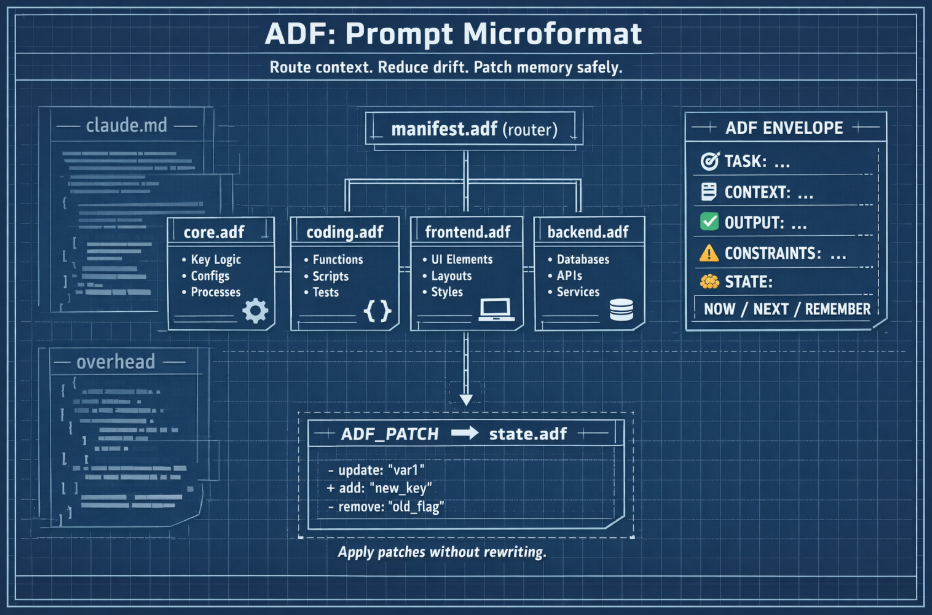

# @stackbilt/adf

ADF (Attention-Directed Format) parser, formatter, patcher, and bundler for [Charter Kit](https://github.com/Stackbilt-dev/charter) -- a local-first governance toolkit for software repos. ADF is an attention-optimized microformat that replaces monolithic context files (`.cursorrules`, `claude.md`) with a modular, AST-backed system designed for LLM context windows.



> **Want the full toolkit?** Just install the CLI -- it includes everything:
> ```bash
> npm install -g @stackbilt/cli
> ```
> Only install this package directly if you need ADF parsing/formatting without the CLI.

## Install

```bash
npm install @stackbilt/adf
```

## What is ADF?

ADF treats LLM context as a compiled language. Key properties:

- **Emoji-decorated semantic keys** act as high-contrast attention boundaries for transformer models
- **Strict AST** with four content types: text, list, map, and metric
- **Patch protocol** for safe delta updates (agents issue typed ops, not full rewrites)
- **Module system** with manifest-based routing, progressive disclosure, and token budgets
- **Weight annotations** distinguish load-bearing constraints from advisory preferences
- **Sync protocol** detects drift between source .adf files and their compressed targets
- **Constraint validation** checks metric ceilings and produces structured pass/fail evidence reports
- **Cadence scheduling** declares check frequency expectations per metric
- **Auto-measurement** via manifest METRICS section mapping metric keys to source files

Example ADF document:

```
ADF: 0.1
TASK: Implement Redis cache layer
CONTEXT:
  - High-traffic /api/users endpoint
  - Cloudflare Workers environment
OUTPUT: Patch diff + brief explanation
CONSTRAINTS [load-bearing]:
  - No new dependencies
  - P99 latency must improve
STATE:
  CURRENT: Baseline endpoint works but slow under load
  NEXT: Add cache + invalidation logic
  METRICS:
    entry_loc: 142 / 200 [lines]
    total_loc: 312 / 400 [lines]
```

## Usage

### Parse an ADF document

```ts
import { parseAdf } from '@stackbilt/adf';

const doc = parseAdf(`
ADF: 0.1
TASK: Build feature
CONSTRAINTS:
  - No new deps
  - Stay fast
STATE:
  CURRENT: Starting
  NEXT: Continue
`);

console.log(doc.version);                // '0.1'
console.log(doc.sections[0].key);        // 'TASK'
console.log(doc.sections[0].content);    // { type: 'text', value: 'Build feature' }
console.log(doc.sections[1].content);    // { type: 'list', items: ['No new deps', 'Stay fast'] }
console.log(doc.sections[2].content);    // { type: 'map', entries: [{key:'CURRENT',value:'Starting'}, ...] }
```

### Parse metric content

```ts
const doc = parseAdf(`
STATE:
  entry_loc: 142 / 200 [lines]
  total_loc: 312 / 400 [lines]
`);

// doc.sections[0].content =>
// { type: 'metric', entries: [
//   { key: 'entry_loc', value: 142, ceiling: 200, unit: 'lines' },
//   { key: 'total_loc', value: 312, ceiling: 400, unit: 'lines' },
// ]}
```

Metric entries use `lowercase_key: value / ceiling [unit]` syntax. Map entries use `UPPERCASE_KEY: value`. This is the disambiguation.

### Parse weight annotations

```ts
const doc = parseAdf(`
CONSTRAINTS [load-bearing]:
  - Max 400 LOC
`);

console.log(doc.sections[0].weight);  // 'load-bearing'
```

Sections can carry `[load-bearing]` or `[advisory]` annotations. Weight defaults to `undefined` when no annotation is present.

### Format to canonical ADF

```ts
import { parseAdf, formatAdf } from '@stackbilt/adf';

const doc = parseAdf(messyInput);
const canonical = formatAdf(doc);
// Sections sorted by canonical key order, standard emoji auto-injected, 2-space indent
// Metric entries formatted as: key: value / ceiling [unit]
// Weight annotations preserved in headers
```

### Apply patches (safe delta updates)

```ts
import { parseAdf, applyPatches, formatAdf } from '@stackbilt/adf';

const doc = parseAdf(input);
const patched = applyPatches(doc, [
  { op: 'ADD_BULLET', section: 'CONSTRAINTS', value: 'Must pass CI' },
  { op: 'REPLACE_BULLET', section: 'STATE', index: 1, value: 'NEXT: Deploy to prod' },
  { op: 'REMOVE_BULLET', section: 'STATE', index: 0 },
  { op: 'ADD_SECTION', key: 'RISKS', content: { type: 'list', items: ['Data loss'] } },
  { op: 'UPDATE_METRIC', section: 'METRICS', key: 'entry_loc', value: 156 },
]);
console.log(formatAdf(patched));
```

Patch operations throw `AdfPatchError` with context on invalid ops (missing section, out-of-bounds index, duplicate section). `UPDATE_METRIC` only changes the value; ceiling and unit are immutable through patches.

### Manifest-based module bundling

```ts
import { parseAdf, parseManifest, resolveModules, bundleModules } from '@stackbilt/adf';
import * as fs from 'node:fs';

const manifestDoc = parseAdf(fs.readFileSync('.ai/manifest.adf', 'utf-8'));
const manifest = parseManifest(manifestDoc);

// Resolve modules for a given task
const keywords = ['React', 'component', 'fix'];
const modules = resolveModules(manifest, keywords);
// => ['core.adf', 'state.adf', 'frontend.adf']

// Bundle into single merged document (pass keywords for trigger observability)
const result = bundleModules('.ai', modules, (p) => fs.readFileSync(p, 'utf-8'), keywords);
console.log(result.tokenEstimate);        // rough token count
console.log(result.tokenBudget);          // from manifest BUDGET section (or null)
console.log(result.tokenUtilization);     // estimate / budget (or null)
console.log(result.perModuleTokens);      // { 'core.adf': 45, 'state.adf': 22, ... }
console.log(result.resolvedModules);      // which modules were loaded
console.log(result.triggerMatches);       // per-trigger detail with matchedKeywords + loadReason
console.log(result.unmatchedModules);     // on-demand modules not resolved
console.log(result.advisoryOnlyModules);  // loaded modules with no load-bearing sections
console.log(result.moduleBudgetOverruns); // modules exceeding their per-module budget
```

## API Reference

### `parseAdf(input: string): AdfDocument`

Tolerant parser that handles messy LLM output. Strips emoji decorations, normalizes line endings, auto-detects content types (text, list, map, metric). Defaults to version `0.1` if version line is missing. Parses `[load-bearing]` and `[advisory]` weight annotations on section headers.

### `formatAdf(doc: AdfDocument): string`

Strict emitter producing canonical ADF. Sorts sections by canonical key order, auto-injects standard emoji decorations when missing, uses 2-space indent for body content. Emits weight annotations and metric entries in canonical form.

### `applyPatches(doc: AdfDocument, ops: PatchOperation[]): AdfDocument`

Immutable patcher. Returns a new document; the original is never mutated. Supports seven operation types:

| Op | Target | Description |
|---|---|---|
| `ADD_BULLET` | list/map section | Append an item or entry |
| `REPLACE_BULLET` | list/map section | Replace item at index |
| `REMOVE_BULLET` | list/map section | Remove item at index |
| `ADD_SECTION` | document | Add new section (throws if duplicate) |
| `REPLACE_SECTION` | document | Replace entire section content |
| `REMOVE_SECTION` | document | Remove section by key |
| `UPDATE_METRIC` | metric section | Update value by key (ceiling/unit immutable) |

### `parseManifest(doc: AdfDocument): Manifest`

Extract routing manifest from a parsed ADF document. Reads `DEFAULT_LOAD`, `ON_DEMAND` (with trigger parsing and optional `[budget: N]` suffix), `BUDGET` (global `MAX_TOKENS`), `SYNC`, `CADENCE`, `METRICS` (source file mappings), `ROLE`, and `RULES` sections.

### `resolveModules(manifest: Manifest, taskKeywords: string[]): string[]`

Resolve which modules to load. Always includes `defaultLoad`; adds `ON_DEMAND` modules whose triggers match any keyword (case-insensitive).

### `bundleModules(basePath: string, modulePaths: string[], readFile: (p: string) => string, taskKeywords?: string[]): BundleResult`

Parse, merge, and bundle resolved modules into a single ADF document. Duplicate sections are merged (lists concatenated, texts joined, maps concatenated, metrics concatenated). Returns token estimate, budget utilization, per-module token counts, trigger match report with keyword-level detail, unmatched modules, and advisory-only module warnings. Optional `taskKeywords` enables richer trigger observability in the report.

### `validateConstraints(doc: AdfDocument, context?: Record<string, number>): EvidenceResult`

Validate all metric entries against their ceilings. Returns a structured evidence report with pass/fail/warn per metric, weight summary, and aggregate counts. Optional `context` parameter injects external measurements (e.g., actual LOC count) that override the document's own values. Status semantics: `value < ceiling` = pass, `value === ceiling` = warn, `value > ceiling` = fail.

### `computeWeightSummary(doc: AdfDocument): WeightSummary`

Count sections by weight category (`load-bearing`, `advisory`, unweighted). Useful independently from constraint validation.

### `parseMarkdownSections(input: string): MarkdownSection[]`

Parse a markdown string into structured sections. Splits on `## ` (H2) headings; content before the first H2 becomes a preamble section. Within each section, sub-elements are classified as rules (with imperative/advisory/neutral strength detection), code blocks (with language tag), table rows, or prose.

### `classifyElement(element: MarkdownElement, heading: string): ClassificationResult`

Classify a single markdown element into an ADF routing decision. Returns STAY (environment/runtime content that should remain in the vendor file) or MIGRATE (with target section, module, and weight). Uses deterministic heuristics based on NEVER/ALWAYS/MUST patterns, heading context, and element type.

### `buildMigrationPlan(sections: MarkdownSection[], existingAdf?: AdfDocument): MigrationPlan`

Build a complete migration plan from parsed markdown sections. If `existingAdf` is provided, uses Jaccard similarity deduplication to skip items already present in the ADF document. Returns classified items, STAY/MIGRATE split, target modules, and summary counts.

### `isDuplicateItem(existing: string, candidate: string): boolean`

Check if two text items are duplicates using Jaccard word similarity with a 0.8 (80%) threshold.

## AST Types

```ts
// --- Document Model ---
interface AdfDocument { version: '0.1'; sections: AdfSection[]; }
interface AdfSection  {
  key: string;
  decoration: string | null;
  content: AdfContent;
  weight?: 'load-bearing' | 'advisory';
}

type AdfContent =
  | { type: 'text'; value: string }
  | { type: 'list'; items: string[] }
  | { type: 'map';  entries: AdfMapEntry[] }
  | { type: 'metric'; entries: AdfMetricEntry[] };

interface AdfMapEntry    { key: string; value: string; }
interface AdfMetricEntry { key: string; value: number; ceiling: number; unit: string; }

// --- Manifest ---
interface Manifest {
  version: '0.1'; role?: string; defaultLoad: string[];
  onDemand: ManifestModule[]; rules: string[]; tokenBudget?: number;
  sync: SyncEntry[]; cadence: CadenceEntry[]; metrics: MetricSource[];
}
interface ManifestModule { path: string; triggers: string[]; loadPolicy: 'DEFAULT' | 'ON_DEMAND'; tokenBudget?: number; }
interface SyncEntry      { source: string; target: string; }
interface CadenceEntry   { check: string; frequency: string; }
interface MetricSource   { key: string; path: string; }

// --- Bundle Result ---
interface BundleResult {
  manifest: Manifest; resolvedModules: string[]; mergedDocument: AdfDocument;
  tokenEstimate: number; tokenBudget: number | null; tokenUtilization: number | null;
  perModuleTokens: Record<string, number>;
  moduleBudgetOverruns: Array<{ module: string; tokens: number; budget: number }>;
  triggerMatches: Array<{
    module: string; trigger: string; matched: boolean;
    matchedKeywords: string[]; loadReason: 'default' | 'trigger';
  }>;
  unmatchedModules: string[];
  advisoryOnlyModules: string[];
}

// --- Constraint Validation ---
type ConstraintStatus = 'pass' | 'fail' | 'warn';
interface ConstraintResult {
  section: string; metric: string; value: number; ceiling: number;
  unit: string; status: ConstraintStatus; message: string; source: 'metric' | 'context';
}
interface WeightSummary  { loadBearing: number; advisory: number; unweighted: number; total: number; }
interface EvidenceResult {
  constraints: ConstraintResult[]; weightSummary: WeightSummary;
  allPassing: boolean; failCount: number; warnCount: number;
}
```

## .adf.lock Format

The sync protocol uses a lockfile (`.adf.lock`) to detect drift between source `.adf` files and their last-known state. The format is a flat JSON object mapping source filenames to truncated SHA-256 hashes:

```json
{
  "core.adf": "54d5c9a146d6da3c",
  "state.adf": "a1b2c3d4e5f67890"
}
```

- **Key:** ADF source filename (relative to `.ai/` directory)
- **Value:** First 16 hex characters of `SHA-256(file_content)`
- **Generated by:** `charter adf sync --write`
- **Checked by:** `charter adf sync --check` (exits 1 if any hash differs)

The hash algorithm: `crypto.createHash('sha256').update(content).digest('hex').slice(0, 16)`.

## Rule Routing Decision Tree

When a task arrives, ADF uses a two-phase resolution to decide which modules to load and where rules belong.

### Phase 1: Module Resolution (manifest.adf → which .adf files to load)

```
Task keywords extracted from prompt
        │
        ▼
┌─────────────────────┐
│ DEFAULT_LOAD modules │──→ Always loaded (e.g., core.adf, state.adf)
└─────────────────────┘
        │
        ▼
┌─────────────────────────────────┐
│ For each ON_DEMAND module:      │
│   For each trigger keyword:     │
│     Match against task keywords │
│     (case-insensitive)          │
└─────────────────────────────────┘
        │
   match found?
   ├── yes → load module
   └── no  → skip (reported as unmatched)
```

**Trigger matching** uses exact match plus prefix stemming. A trigger matches a keyword if:

- **Exact**: `trigger === keyword` (case-insensitive)
- **Prefix stem**: one is a prefix of the other, the prefix is ≥ 4 chars, and the prefix is ≥ 66% of the full word's length

Examples: trigger `"react"` matches keyword `"reactivity"` (prefix, 5/10 = 50% — no match, too short ratio). Trigger `"deploy"` matches `"deploying"` (prefix, 6/9 = 67% — match).

**Manifest syntax** for ON_DEMAND entries:

```
📂 ON_DEMAND:
  - frontend.adf (Triggers on: React, CSS, UI)
  - security.adf (Triggers on: auth, CORS, token) [budget: 800]
```

The optional `[budget: N]` suffix sets a per-module token ceiling.

### Phase 2: Rule Placement (content → which section inside a module)

When migrating rules from markdown (e.g., CLAUDE.md) into ADF, the content classifier routes each element:

```
Element text
     │
     ▼
Match STAY patterns?  ──→ yes → STAY (env/runtime, keep in vendor file)
     │                          Examples: WSL, credential helper, /mnt/c/
     no
     │
     ▼
Route by heading context ──→ maps to target module:
     │                        frontend keywords → frontend.adf
     │                        auth/security     → security.adf
     │                        deploy/infra/CI   → infra.adf
     │                        api/db/backend    → backend.adf
     │                        fallback          → core.adf
     │
     ▼
If heading routed to core.adf,
check element content against
ON_DEMAND trigger keywords ──→ may re-route to a specialist module
     │
     ▼
Route by element type + strength:
     │
     ├── rule (imperative: NEVER/ALWAYS/MUST)
     │   → CONSTRAINTS [load-bearing]
     │
     ├── rule (advisory: prefer/should/bias)
     │   → ADVISORY [advisory]
     │
     ├── rule (neutral) + convention heading
     │   → CONSTRAINTS [advisory]
     │
     ├── rule (neutral) + git/workflow heading
     │   → CONSTRAINTS [load-bearing]
     │
     ├── rule (neutral, default)
     │   → CONSTRAINTS [advisory]
     │
     ├── code-block
     │   → CONTEXT [advisory]
     │
     ├── table-row
     │   → CONTEXT [advisory]
     │
     └── prose
         ├── architecture keywords → CONTEXT [advisory]
         ├── config/structure      → CONTEXT [advisory]
         └── default               → CONTEXT [advisory]
```

### Quick Reference: Where Should a Rule Go?

| Rule type | Target section | Weight | Example |
|---|---|---|---|
| Hard constraint (`NEVER`, `MUST`, `ALWAYS`) | CONSTRAINTS | load-bearing | "NEVER skip pre-commit hooks" |
| Preference (`prefer`, `should`, `bias toward`) | ADVISORY | advisory | "Prefer pure functions in library code" |
| Convention (naming, style, format) | CONSTRAINTS | advisory | "kebab-case filenames" |
| Git/workflow rule | CONSTRAINTS | load-bearing | "Commits via smart-commit.sh only" |
| Architecture description | CONTEXT | advisory | "Package flow: types ← cli" |
| Environment/runtime specific | STAY in vendor file | — | "Use git-credential-manager.exe in WSL" |

## Section Taxonomy

ADF sections use `UPPERCASE_KEY` names with optional emoji decorations and weight annotations.

### Canonical Sections

The following sections have standard emoji decorations and a defined sort order. The formatter auto-injects decorations when missing.

| Key | Emoji | Content type | Purpose |
|---|---|---|---|
| `TASK` | 🎯 | text | Current task description |
| `ROLE` | 🧑 | text | Agent role / persona |
| `CONTEXT` | 📋 | list, map, or text | Background knowledge, architecture, stack info |
| `OUTPUT` | ✅ | text | Expected deliverable format |
| `CONSTRAINTS` | ⚠️ | list | Hard and soft rules the agent must follow |
| `RULES` | 📐 | list | Manifest-level routing rules |
| `DEFAULT_LOAD` | 📦 | list | Modules loaded on every task (manifest only) |
| `ON_DEMAND` | 📂 | list | Trigger-gated modules (manifest only) |
| `BUDGET` | 💰 | map | Token budget (`MAX_TOKENS: N`) |
| `SYNC` | 🔄 | list | Source → target sync pairs |
| `CADENCE` | 📊 | map | Check frequency per metric |
| `FILES` | 🗂️ | list | Relevant file paths |
| `TOOLS` | 🛠️ | list | Available tools or commands |
| `RISKS` | 🚨 | list | Known risks or blockers |
| `STATE` | 🧠 | map or metric | Current/next state, metric ceilings |
| `GUIDE` | 📖 | text | Instructional or reference content |

### Open vs Closed

**Sections are open.** Any `UPPERCASE_KEY` is a valid section name. The canonical set above gets standard emoji decorations and sort-order priority; non-canonical sections are appended after canonical ones in document order.

This means you can add custom sections like `ADVISORY`, `METRICS`, `EXAMPLES`, or domain-specific keys without parser changes. The parser recognizes any line matching `EMOJI? UPPERCASE_KEY [weight]?:` as a section header.

### Emoji Semantics

Emoji decorations are **semantic attention markers**, not cosmetic:

- They act as high-contrast token boundaries for transformer attention
- The formatter auto-injects standard decorations for canonical keys
- Custom sections can use any emoji (or none) — the parser strips them for AST processing
- Emoji is never part of the key itself; `🎯 TASK:` and `TASK:` parse identically

### Weight Annotations

Sections can carry a weight annotation in brackets after the key name:

```
⚠️ CONSTRAINTS [load-bearing]:
  - Must pass CI

📋 CONTEXT [advisory]:
  - Cloudflare Workers environment
```

| Weight | Meaning | Validation behavior |
|---|---|---|
| `[load-bearing]` | Violation = failure | Evidence report marks ceiling breaches as `fail` |
| `[advisory]` | Violation = warning | Evidence report marks ceiling breaches as `warn` |
| *(none)* | Unweighted | No special validation treatment |

Weight annotations are preserved through parse → format round-trips and are used by `validateConstraints()` and `computeWeightSummary()` to produce structured evidence reports.

### Content Type Disambiguation

The parser auto-detects content type from body lines:

| Pattern | Detected type | Example |
|---|---|---|
| `- item` (all lines) | `list` | `- No new deps` |
| `lowercase_key: N / M [unit]` (all lines) | `metric` | `entry_loc: 142 / 200 [lines]` |
| `UPPERCASE_KEY: value` (all lines) | `map` | `CURRENT: Starting` |
| Anything else | `text` | Free-form prose |

If the section has only an inline value (on the header line) and no body, it's always `text`.

## Error Types

- `AdfParseError` -- invalid document structure (with optional line number)
- `AdfPatchError` -- invalid patch operation (with op name, section, index context)
- `AdfBundleError` -- module resolution failure (with optional module path)

## Self-Governance

Charter uses `@stackbilt/adf` to govern its own codebase. The `.ai/manifest.adf` maps metric keys to source files, and `validateConstraints()` with auto-measured line counts enforces LOC ceilings on every key module. When `adf_commands_loc` approaches its 900-line ceiling, the evidence report signals that a refactor is needed -- the same mechanism available to any project using ADF.

## Requirements

- Node >= 18
- Zero runtime dependencies

## License

Apache-2.0

## Links

- [Repository](https://github.com/Stackbilt-dev/charter)
- [Issues](https://github.com/Stackbilt-dev/charter/issues)
